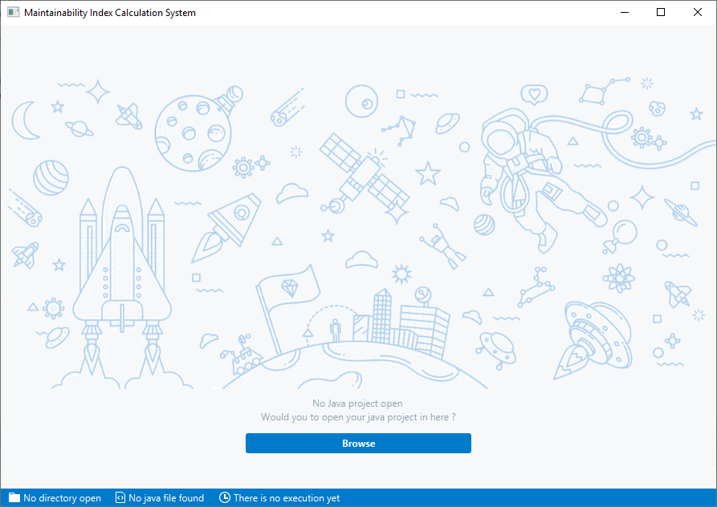
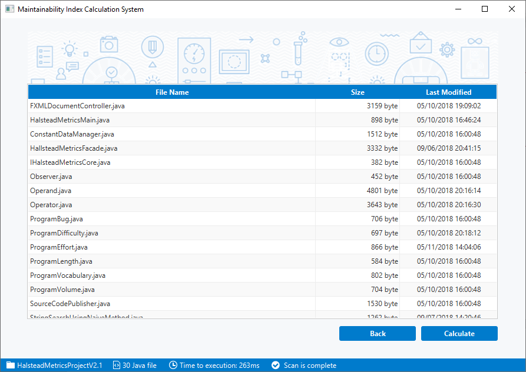
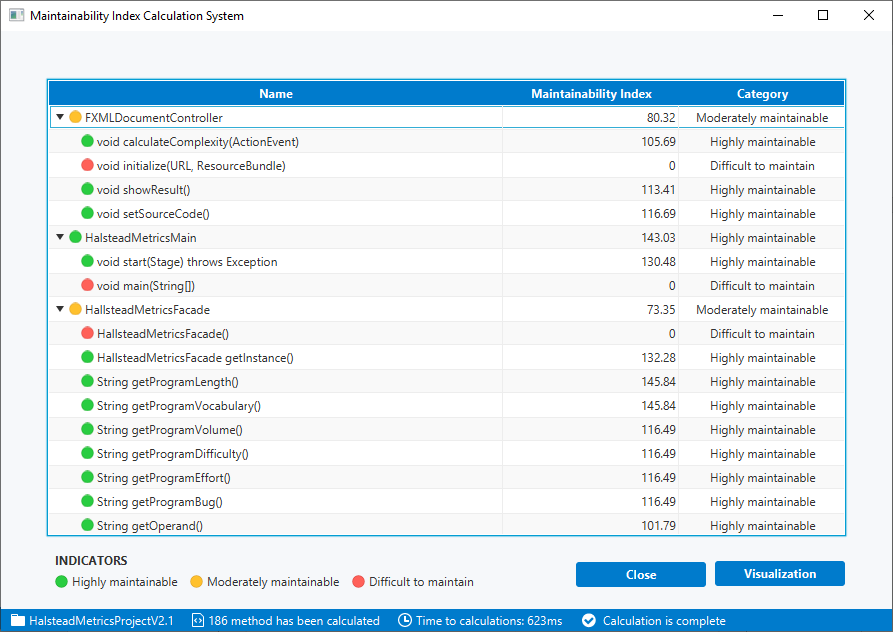
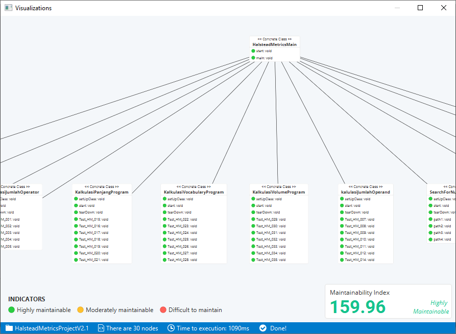

# Maintainability Index Calculations System
<p align="justify">
Sistem kalkulasi Maintainability Index ini merupakan sistem yang dibangun untuk memberikan informasi nilai Maintainability Index. Di dalam sistem ini developer bisa memasukan directory project java dimana di dalam directory atau sub directory terdapat berkas kode sumber java. Selanjutnya sistem akan mengalkulasi Maintainability Index dengan terlebih dahulu mengalkulasi lines of code (LOC), Halstead metric, dan Cyclomatic Complexity.Pada sistem ini akan menampilkan hasilnya dalam bentuk tabel dan memvisualisasikan dalam bentuk graph. 
</p>

<p align="justify">
_The Maintainability Index calculations system provide features for calculate Maintainability Index values of the Java source code and display graph visualizations.  This system uses Java technology that allows the system to run on platforms that support JRE (java runtime environment)._
</p>

#### Maintainability Index Clasifications
| MI Values  | Clasifications |
| :---: | ------------- |
| _x > 85_  | Highly maintainable  |
| _65 < x ≤ 85_  | Moderately maintainable  |
| _x ≤ 65_  | Difficult to maintain  |
> Coleman, D., Ash, D., Lowther, B. & Oman, P., 1994. Using metrics to evaluate software system maintainability, in Computer.

## Technologies
* Java 8
* JavaFX 
* [JFeonix](http://www.jfoenix.com/) - JavaFX Material Design Library
* [FontAwesomeFX](https://www.jensd.de/wordpress/) - Font Icon for JavaFX 
* [AnimateFX](https://typhon0.github.io/AnimateFX/) - Animations for JavaFX


## Build With
* [Maven](https://maven.apache.org/) - Dependency Management

## Installing

Run project via terminal 
```
cd ../MaintainabilityIndex

mvn clean compile exec:java
```

Execute .jar file
```
cd ../MaintainabilityIndex/target

java -jar MaintainabilityIndex-1.0.jar
```

## Screenshot
<p align="center">
  
</p>

<p align="center">
  
</p>

<p align="center">
  
</p>

<p align="center">
  
</p>

<p align="center">
  
</p>

## Authors
* **Rasio Ganang Atmaja**
* **Bayu Priyambadha**
* **Fajar Pradana**


